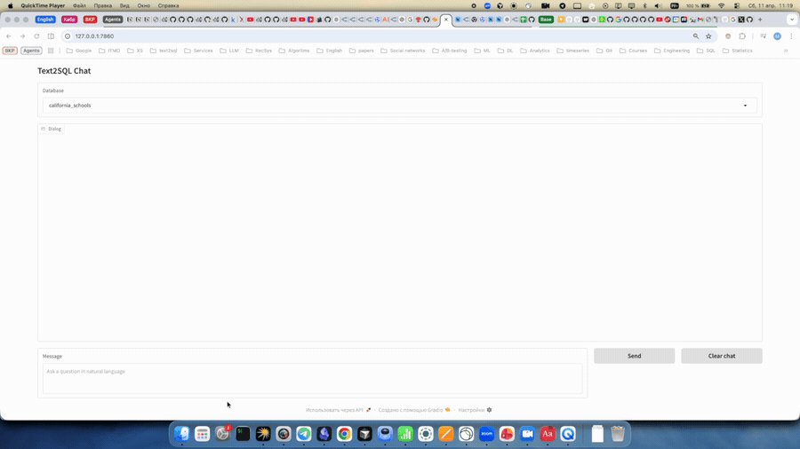

# Text2SQL agent

## Проблематика

Современные крупные компании, особенно работающие в технологически насыщенных отраслях, сталкиваются с экспоненциальным ростом объемов данных и сложности аналитической инфраструктуры. За годы развития бизнеса формируются сотни таблиц, витрин данных и аналитических хранилищ, сопровождаемых обширной документацией, созданной различными командами аналитиков в разное время. Эта документация часто носит фрагментарный характер, содержит устаревшие описания и отражает исторически сложившиеся подходы к расчету показателей. Поддержание такой экосистемы требует значительных человеческих ресурсов: специалистов, обладающих не только техническими навыками, но и глубоким пониманием бизнес-логики, особенностей расчета метрик и множества исключений из общих правил.
В результате даже относительно простые аналитические запросы со стороны бизнеса могут занимать часы или дни на обработку. Аналитику необходимо определить источник данных, корректную методику расчёта, учесть пограничные случаи и согласовать результаты с существующими стандартами отчетности. Подобная инерционность аналитических процессов существенно снижает скорость принятия управленческих решений и противоречит требованиям современного динамичного рынка, где оперативность доступа к данным становится критическим конкурентным преимуществом.
По этой причине на протяжении последних лет активно развиваются подходы к автоматизации получения аналитической информации. Эволюция таких решений прошла путь от простых систем, основанных на правилах и регулярных выражениях, к современным интеллектуальным системам, использующим методы обработки естественного языка и большие языковые модели.

## Актуальность проблемы

Актуальность рассматриваемой проблемы подтверждается тем, что несмотря на широкое распространение BI-платформ и инструментов визуальной аналитики, доступ к данным по-прежнему остаётся сложным для значительной части сотрудников. Наличие большого количества дашбордов и каталогов отчетности не гарантирует удобства навигации и понимания структуры данных. Пользователю, не являющемуся профессиональным аналитиком, зачастую трудно определить, где именно находится необходимая информация и какие показатели следует использовать. В результате возникает фрагментация аналитического ландшафта: данные формально доступны, но практически недостижимы без посредничества специалистов. Создание интеллектуального ассистента, способного преобразовывать естественно-языковые запросы в корректные SQL-запросы, представляет собой перспективный путь к демократизации доступа к данным и повышению эффективности принятия решений на всех уровнях управления.

## PoC

На демо будет представлен веб-интерфейс, позволяющий задавать вопросы по данным на естественном языке. Агент самостоятельно определяет нужную базу данных, исследует её схему и возвращает SQL-запрос с результатом.



**Out of scope для PoC:**

- End-to-end аналитика с применением инструментов прогнозирования на основе полученных данных
- Поиск и интеграция инсайтов из внешних источников (например, объяснение падения метрик через внешние события)

## Быстрый старт

1. Скопируйте `.env.example` в `.env` и укажите ключ OpenRouter:
  ```bash
   cp .env.example .env
  ```
2. Установите зависимости:
  ```bash
   poetry install
  ```
3. Скачайте данные BIRD и подготовьте документацию — см. [docs/data-setup.md](docs/data-setup.md)
4. Запустите веб-интерфейс:
  ```bash
   poetry run python scripts/run_text2sql_web.py
  ```

## Документация


| Документ                                             | Описание                                                        |
| ---------------------------------------------------- | --------------------------------------------------------------- |
| [docs/product-proposal.md](docs/product-proposal.md) | Цели, метрики, сценарии использования                           |
| [docs/system-design.md](docs/system-design.md)       | Архитектурные решения, модули, workflow, контракты, ограничения |
| [docs/architecture.md](docs/architecture.md)         | Обзор архитектуры и возможностей агента                         |
| [docs/data-setup.md](docs/data-setup.md)             | Инструкция по загрузке данных BIRD                              |
| [docs/governance.md](docs/governance.md)             | Риски и меры безопасности                                       |


**Диаграммы** (`docs/diagrams/`):
[C4 Context](docs/diagrams/c4-context.md) · [C4 Container](docs/diagrams/c4-container.md) · [C4 Component](docs/diagrams/c4-component.md) · [Workflow](docs/diagrams/workflow.md) · [Data Flow](docs/diagrams/data-flow.md)

**Спецификации модулей** (`docs/specs/`):
[Retriever](docs/specs/retriever.md) · [Tools](docs/specs/tools.md) · [Memory/Context](docs/specs/memory-context.md) · [Agent/Orchestrator](docs/specs/agent-orchestrator.md) · [Serving/Config](docs/specs/serving-config.md)