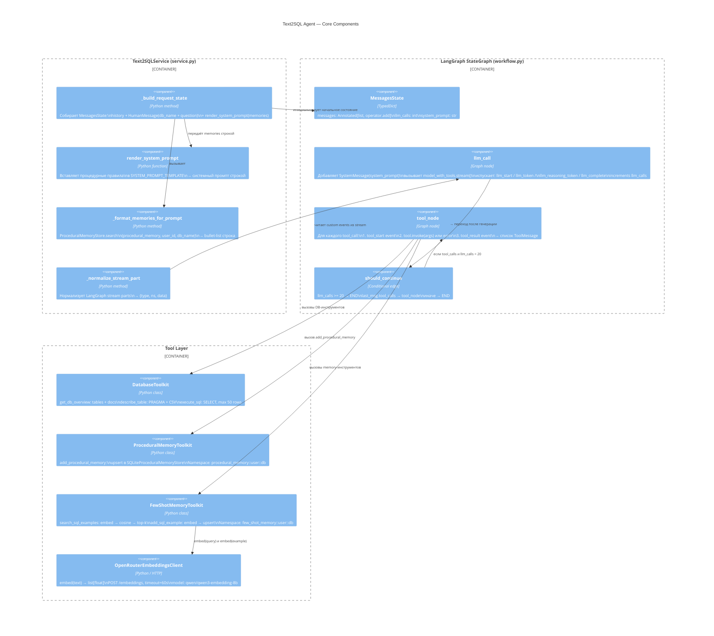

# C4 Component — Agent Core

Внутреннее устройство ядра системы: `Text2SQLService`, `LangGraph Agent` и `Tool Layer`.

## Жизненный цикл компонентов

| Компонент | Время жизни | Инициализация |
|-----------|-------------|---------------|
| `Text2SQLService` | Весь процесс | При запуске скрипта; повторная не нужна |
| `LangGraph StateGraph` | Компилируется один раз | `build_agent()` при старте `Text2SQLService` |
| `MessagesState` | Один запрос к агенту | `_build_request_state()` перед каждым `ask` / `ask_stream` |
| `SQLiteProceduralMemoryStore` | Весь процесс | При старте; персистентен между запросами |
| `SQLiteFewShotMemoryStore` | Весь процесс | При старте; персистентен между запросами |
| `OpenRouterEmbeddingsClient` | Весь процесс | При старте `Text2SQLService`; stateless |
