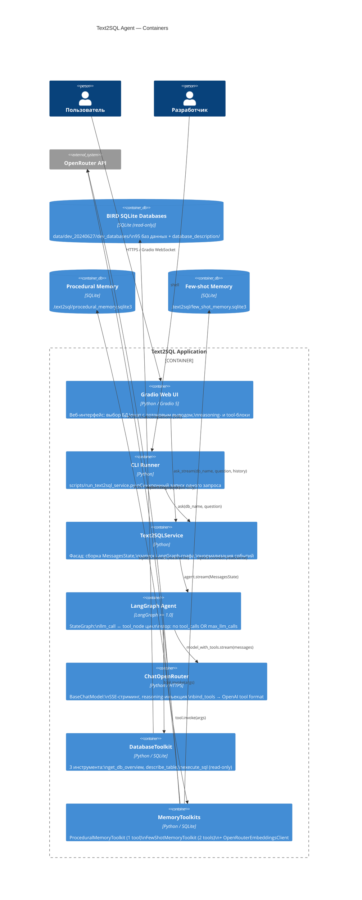

# C4 Container — Text2SQL Agent

Внутренние контейнеры приложения и их взаимодействие.

## Ключевые потоки

| Поток | Направление | Формат |
|-------|-------------|--------|
| Запрос пользователя | Gradio → Service → Agent | Python objects |
| Стриминг токенов | Agent → Service → Gradio | custom events: `{event, text}` |
| Tool calls | Agent → Toolkits → Agent | LangChain ToolMessage |
| LLM inference | ChatOpenRouter → OpenRouter | HTTPS SSE |
| Embeddings | MemoryToolkits → OpenRouter | HTTPS sync POST |
| DB queries | DatabaseToolkit → BIRD SQLite | SQLite read-only |
| Memory read/write | MemoryToolkits → SQLite stores | SQLite mutex-protected |
