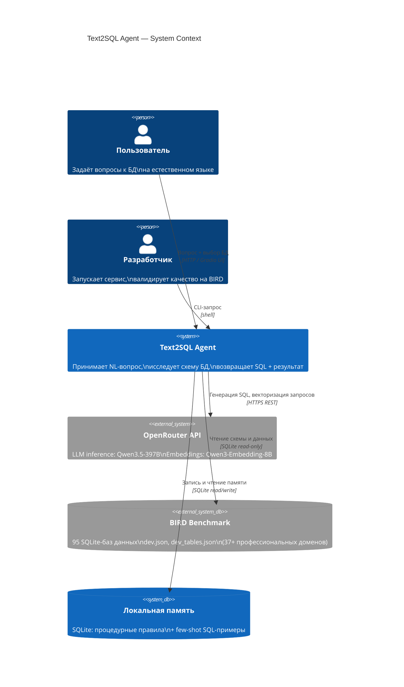

# C4 Context — Text2SQL Agent

Внешний вид системы: кто взаимодействует с ней и какие внешние сервисы она использует.

## Границы системы

- **Text2SQL Agent** — единственная система в периметре; всё остальное внешнее
- **OpenRouter API** — внешний платный сервис; доступен только при наличии `OPEN_ROUTER_API_KEY`
- **BIRD Benchmark** — локальные данные, не включены в репозиторий (см. [data-setup.md](../data-setup.md))
- **Локальная память** — SQLite-файлы в `.text2sql/`; не синхронизируются между инстансами
