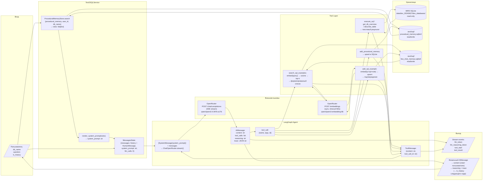

# Data Flow Diagram

Как данные проходят через систему: что читается, что записывается, что логируется.

## Что хранится

| Данные | Хранилище | Время жизни | Формат |
|--------|-----------|-------------|--------|
| Процедурные правила | `.text2sql/procedural_memory.sqlite3` | Постоянно (между сессиями) | JSON `{memory, db_name, user_id, created_at}` |
| Few-shot примеры | `.text2sql/few_shot_memory.sqlite3` | Постоянно (между сессиями) | `(user_query, sql_query, note, embedding_json)` |
| История диалога | `gr.State` в Gradio UI | Текущая сессия браузера | `list[BaseMessage]` |
| Reasoning + trace | `AIMessage.additional_kwargs` | Текущий ход → передаётся в следующий | `str` (reasoning), `str` (JSON trace) |

## Что логируется

| Событие | Тип | Получатель |
|---------|-----|------------|
| `llm_token` | Streaming event | Gradio UI (отображается в реальном времени) |
| `llm_reasoning_token` | Streaming event | Gradio UI (сворачиваемый блок "Thinking #N") |
| `tool_start` | Streaming event | Gradio UI (блок "Using tool X" с аргументами) |
| `tool_result` | Streaming event | Gradio UI (содержимое ответа инструмента) |
| `llm_complete` | Streaming event | Gradio UI (финализация шага) |

**Не логируется:** token usage, request latency, error rate, стоимость запросов.
