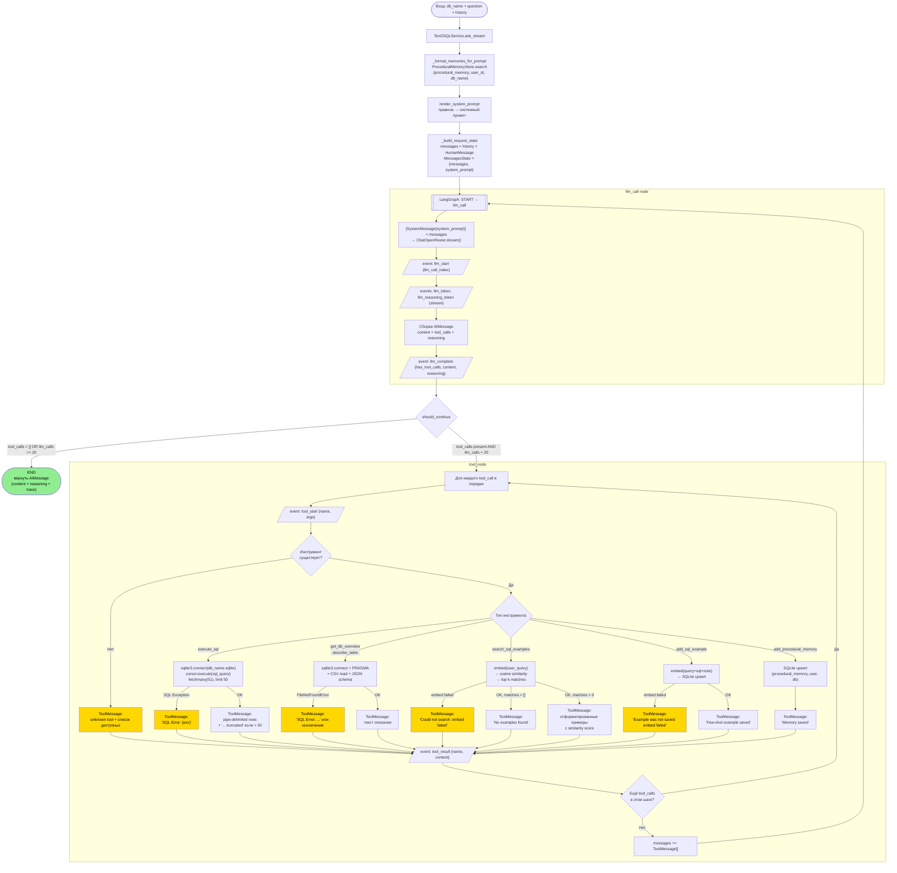

# Workflow Diagram — Выполнение запроса

Пошаговое выполнение запроса от пользователя до финального ответа, включая ветки ошибок.

## Замечания по ошибкам

- Все ошибки инструментов **не прерывают граф** — они возвращаются агенту как строки внутри `ToolMessage`
- Агент видит ошибку SQL и может попробовать исправленный запрос (self-correction)
- Исключения при вызове инструментов с неправильными аргументами форматируются с `expected_args`
- Единственный hard stop — достижение `llm_calls >= max_llm_calls = 20`
- Ошибки embedding при `search_sql_examples` non-fatal: агент продолжает работу без примеров
